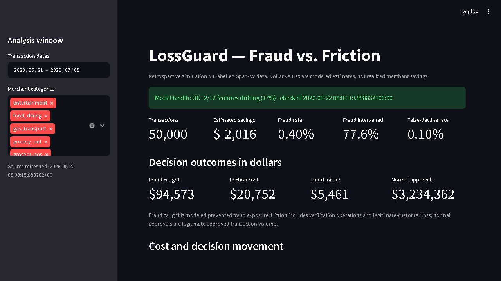
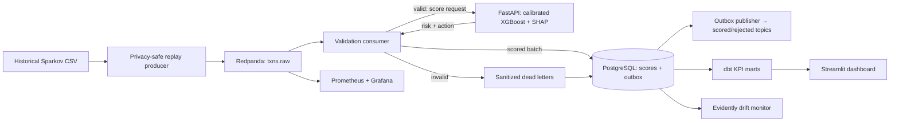

# LossGuard — fraud vs. friction

Fraud teams have to stop stolen payments without blocking good customers. A model that catches
every fraud case can still be expensive if it declines too many legitimate purchases. LossGuard
turns a fraud-risk estimate into an **approve, verify, or decline** recommendation, then shows the
trade-off in modeled dollars. It is a local, retrospective simulation—not a payment processor or
evidence of realized merchant savings.

## Results at a glance

> On **555,719 independent held-out transactions**: **ROC AUC 0.9936**, **average precision
> 0.7942**. The calibrated, category-specific policy incurred **$227,654 simulated cost versus
> $1,133,325 if every transaction were approved**—an estimated **79.9% reduction** under the
> [documented cost assumptions](docs/business-assumptions.md).

These are results from the tracked [model metadata](models/model_metadata.json), not a live
merchant trial. The model trained on the first 300,000 timestamp-ordered training-file rows
(210,000 train / 45,000 calibration / 45,000 threshold validation); the final evaluation used the
entire separate test file. Its fraud rate was 0.386%. See the [model card](docs/model-card.md) for
probability-quality metrics, intervention rates, and limitations.

In a separate local **demo-mode** replay, the producer published 10,000 valid transactions in
about 6 minutes 22 seconds (roughly 26 events/second); all 10,000 were scored and consumer lag
returned to zero. That is an observed, delay-controlled replay run, **not maximum pipeline
throughput**. Invalid source rows skipped before Kafka are not included in that 10,000.

### Why cost-sensitive decisions?

Imagine a $40 purchase. If its estimated fraud risk is 5%, approving it carries about **$2 in
expected fraud loss**. A verification step has a **$3 operating cost** in this simulation, even
before considering the chance a legitimate customer abandons the purchase. At 50% risk, expected
fraud loss rises to $20, making an intervention more plausible. The actual policy also considers
fraud caught by verification, gross margin, and customer reacquisition cost; it does not use this
simple calculation as its decision rule.

## See the product



The screenshot shows a **50,000-transaction replay slice**. Its savings card compares the
category-specific policy with the **global-threshold policy**, so it can be negative for a slice.
The 79.9% benchmark above instead compares the **full offline test** with **approve everything**;
the two figures have different populations and baselines and must not be compared directly.
The dashboard also offers a segment table, a live threshold simulator, and transaction-level SHAP
explanations. Optional Grafana panels show ingestion, consumer lag, validation failures, and
container health.

## How it works



1. The producer reads time-sorted transactions, hashes the customer identifier, removes direct
   identifiers, derives model fields, and publishes valid events to Kafka-compatible Redpanda.
   `demo` replays source time at 720×, `realtime` caps any gap at two seconds, and `max` adds no
   delay. “Real-time” here means **historical event-by-event replay**, not live payment traffic.
2. The consumer validates again. Bad Kafka events become sanitized PostgreSQL dead letters and
   rejected-topic messages; valid events go to the scoring API. Producer-side invalid CSV rows
   are currently logged and skipped **before** Kafka, not dead-lettered.
3. XGBoost estimates fraud risk; an isotonic calibrator makes scores suitable for expected-cost
   calculations. Category thresholds choose approve, verify, or decline. SHAP supplies the largest
   feature contributions for each scored transaction.
4. PostgreSQL batches decisions, dead letters, metrics, and outbox messages in one transaction.
   The consumer commits Kafka offsets only after database persistence; the publisher confirms
   outgoing broker writes before marking outbox rows delivered. Delivery is **at-least-once**,
   with idempotent database IDs/dedupe keys—not an exactly-once guarantee.
5. dbt builds tested daily and segment-level KPIs. Streamlit shows modeled fraud caught, fraud
   missed, customer-friction cost, legitimate approved volume, and a threshold slider that
   recalculates dollar outcomes without reloading the page.
6. Optional Prometheus/Grafana tracks pipeline health; scheduled Evidently reports compare recent
   feature distributions with training data. Transaction review shows raw SHAP plus a plain-English
   sentence, using a deterministic local template unless an optional LLM provider is configured.

**Stack:** Python 3.12, Redpanda (Kafka API), Pydantic, PostgreSQL 16, XGBoost,
scikit-learn/isotonic calibration, FastAPI, SHAP, dbt, Streamlit/Plotly, Evidently,
Prometheus/Grafana, Docker Compose. Services have separate runtime, training, test, dbt, and
monitoring dependency locks and run as a non-root user; the optional cAdvisor container is
privileged and must be enabled explicitly.

## Dataset and evaluation

The [public synthetic Sparkov/Kaggle dataset](https://www.kaggle.com/datasets/kartik2112/fraud-detection)
is used locally; its CSVs are ignored by Git. Put both files in `dataset/` without renaming them.

| File | Role | Rows | Event-time range |
|---|---|---:|---|
| `fraudTrain.csv` | Model development and drift reference | 1,296,675 | 2019-01-01 to 2020-06-21 |
| `fraudTest.csv` | Independent offline evaluation and historical replay | 555,719 | 2020-06-21 to 2020-12-31 |

The training process uses disjoint chronological **train → calibration → threshold-validation**
windows from a default 300,000-row cap. It evaluates on all 555,719 test rows after threshold
selection. `TRAIN_MAX_ROWS=0` removes the laptop-oriented training cap; leave `TEST_MAX_ROWS=0`
for reported results. The offline loader and replay producer do not filter identically: the
producer rejects underage source rows before Kafka, while final offline evaluation includes them.
That difference matters when reconciling dashboard and offline totals.

Model results depend on simulated verification, abandonment, gross-margin, and reacquisition
costs. The source does **not** contain real merchant margins or lifetime value. Read the
[business assumptions](docs/business-assumptions.md) and [model card](docs/model-card.md) before
interpreting dollars or ranking policies. Dataset file hashes, row counts, date ranges, labels,
and schema are checked against [the manifest](config/dataset_manifest.json):

```powershell
python scripts/validate_dataset.py --data-dir dataset
```

```bash
python scripts/validate_dataset.py --data-dir dataset
```

## Run locally

Prerequisites: Docker Desktop **4.28+** with Linux containers, Docker Compose **2.24.4+**, the
two CSVs above, approximately **15 GB free disk**, and **8 GB available to Docker for first-time
training**. Commands run from the repository root. No `.env` secrets or dataset files belong in
Git. The bootstrap generates local database, API, salt, and Grafana credentials and refuses to
overwrite an existing `.env`.

```powershell
python scripts/bootstrap_env.py
docker compose up -d --build
```

```bash
python scripts/bootstrap_env.py
docker compose up -d --build
```

Startup validates the dataset, verifies or trains a checksum-protected local model bundle,
applies versioned PostgreSQL migrations, starts the API, then starts consumer and producer.
Wait for producer exit and zero `TOTAL-LAG`, then build the dbt marts used by the dashboard:

```powershell
docker compose ps -a
docker compose exec -T redpanda rpk -X brokers=redpanda:9092 group describe lossguard-scorers
docker compose --profile tools run --rm dbt build --profiles-dir .
```

```bash
docker compose ps -a
docker compose exec -T redpanda rpk -X brokers=redpanda:9092 group describe lossguard-scorers
docker compose --profile tools run --rm dbt build --profiles-dir .
```

Open [Streamlit](http://localhost:8501) and the [FastAPI docs](http://localhost:8000/docs).
`/score` needs the generated `X-API-Key`; `/reload` needs the separate `X-Admin-Key`.
`/health` is public for local health checks. All published service ports bind to `127.0.0.1`.

The default producer runs `REPLAY_MODE=demo` with `REPLAY_LIMIT=10000`. To run a larger,
unthrottled replay after startup, use:

```powershell
docker compose run --rm -e REPLAY_LIMIT=50000 -e REPLAY_MODE=max producer
```

```bash
docker compose run --rm -e REPLAY_LIMIT=50000 -e REPLAY_MODE=max producer
```

| Replay mode | Delay between timestamp-sorted events |
|---|---|
| `demo` (default) | `max(actual_gap / 720, 0.001)` seconds; about one source day in two minutes |
| `realtime` | Actual historical gap, capped at two seconds, with a 0.001-second floor |
| `max` | No artificial delay; use for throughput experiments |

The two-second cap makes long overnight gaps practical in a demo. Replaying the same transaction
can repeat a Kafka event; PostgreSQL uses the transaction ID to avoid duplicate scored rows.

### Optional monitoring and explanations

Core Compose does not start Grafana, Prometheus, or privileged cAdvisor. Enable the observability
overlay only when needed; then open [Grafana](http://localhost:3000) and
[Prometheus](http://localhost:9090). Grafana's generated local credentials are in the ignored
`.env`. The dashboard includes consumer lag, ingestion rate, validation failures, container
health, and SHAP-generation failures.

```powershell
docker compose -f docker-compose.yml -f docker-compose.observability.yml `
  --profile observability up -d
```

```bash
docker compose -f docker-compose.yml -f docker-compose.observability.yml \
  --profile observability up -d
```

Drift monitoring runs at startup and weekly by default. It persists JSON/HTML reports and
`OK`, `DRIFTING`, `STALE`, `INSUFFICIENT DATA`, or `ERROR` status for Streamlit. A controlled
distribution-shift demonstration changes only the analysis frame, not stored transactions:

```powershell
docker compose run --rm drift-monitor python -m monitoring.drift_job --simulate-shift
```

```bash
docker compose run --rm drift-monitor python -m monitoring.drift_job --simulate-shift
```

SHAP-to-English explanations work locally without API keys. For optional Claude, OpenAI,
Gemini, or OpenAI-compatible endpoints, configure one provider in the ignored `.env` using the
names in [.env.example](.env.example), then recreate `dashboard`. Only allowlisted typed facts
are sent externally; the output is constrained to one short sentence, with local fallback on
failure. Slack high-risk alerts are also optional (`SLACK_WEBHOOK_URL`). Never commit provider
keys or webhook URLs.

## Reliability, safety, and limits

- Bad Kafka events retain only allowlisted rejection metadata, size, and digest; raw payloads and
  unknown fields are not stored. Verify routing with `scripts/verify_dead_letter.py`.
- Database schema uses checksum-validated migrations. PostgreSQL writes are pooled and batched;
  the outbox protects broker publication across consumer retries. The system remains a
  single-node local reference, not a production high-availability deployment.
- Default retention: scored transactions 730 days, dead letters 30 days, pipeline metrics 90
  days, drift reports 180 days, published outbox rows 7 days. Kafka transaction topics retain
  seven days; rejection summaries retain 30 days. Back up existing volumes before retention
  runs if older records matter.
- Customer identifiers are salted hashes; raw card numbers, names, addresses, and dates of birth
  do not leave the producer. The model binary is **trusted-local-only**: SHA-256 guards accidental
  mismatch with its sidecar but is not a publisher signature, and `joblib` must not load untrusted
  uploads.
- Historical fraud labels are available immediately in this synthetic replay. Real payment
  systems need delayed-label reconciliation, independent validation, signed model promotion,
  production IAM/TLS, fairness review, and capacity testing. A live provider webhook and a
  current-dated simulator are [future work](docs/scope.md), not present capabilities.

If Docker Desktop's WSL integration fails, inspect `docker info`, `docker system df`, and
`wsl --list --verbose` first. Quit Docker Desktop, run `wsl --shutdown` in PowerShell, reopen
Desktop, and check **Settings → Resources → WSL integration**. Avoid factory reset or volume
pruning as a first response; those can destroy local data.

## Tests and repository guide

```powershell
docker compose --profile tools build test
docker compose --profile tools run --rm --env-from-file .env test
docker compose --profile tools run --rm test python -m ruff check .
docker compose --profile tools run --rm test python -m ruff format --check .
docker compose config --quiet
```

```bash
docker compose --profile tools build test
docker compose --profile tools run --rm --env-from-file .env test
docker compose --profile tools run --rm test python -m ruff check .
docker compose --profile tools run --rm test python -m ruff format --check .
docker compose config --quiet
```

The non-UI coverage gate is 75% with branch coverage. CI also exercises real Redpanda and
PostgreSQL integration tests for retries, broker confirmation, and duplicate processing.

| Location | What is there |
|---|---|
| `apps/` | Replay producer, validation consumer, scoring API, outbox publisher, dashboard |
| `src/lossguard/` | Shared schemas, privacy, features, costs, Kafka, and database code |
| `ml/`, `models/` | Training/evaluation and tracked metadata; generated model binary is ignored |
| `analytics/dbt/` | Tested staging, daily, and segment KPI models |
| `infrastructure/`, `monitoring/` | Migrations, Grafana/Prometheus, Evidently drift jobs |
| `docs/` | [Scope](docs/scope.md), [model card](docs/model-card.md), [business assumptions](docs/business-assumptions.md) |

Read [CONTRIBUTING.md](CONTRIBUTING.md) for a review path and non-Docker setup. LossGuard is
licensed under [MIT](LICENSE).
