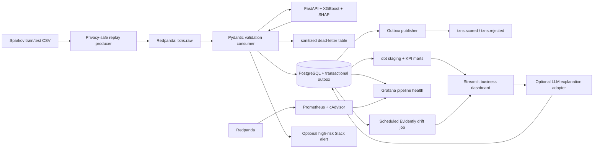

# LossGuard

LossGuard is a local reference implementation of a transaction-risk platform. It recommends
`approve`, `verify`, or `decline` by comparing expected fraud loss with the cost of inconveniencing
legitimate customers. The project covers streaming ingestion, validation, model serving,
cost-sensitive policy selection, analytics, observability, drift monitoring, and explainability.

LossGuard is a retrospective simulation. It does not authorize payments or claim realized merchant
savings.

## What LossGuard does

LossGuard helps a fraud team decide whether to approve, verify, or decline each transaction. It does
not optimize model accuracy in isolation. It compares the expected cost of fraud with the cost of
challenging or rejecting a legitimate customer, then applies the least-cost action for that merchant
category.

The dashboard translates those decisions into business outcomes: fraud caught, fraud missed,
customer-friction cost, normal approved volume, and estimated savings against a documented baseline.
Analysts can move the decision threshold and immediately see how the dollar trade-off changes.

## How it works

1. A replay producer reads timestamped Sparkov transactions, removes direct identifiers, engineers
   model features, and publishes privacy-safe events to Redpanda.
2. The consumer validates every event. Valid transactions continue to scoring; malformed records go
   to a sanitized PostgreSQL dead-letter table.
3. FastAPI serves a checksum-verified XGBoost bundle. A separately fitted isotonic calibrator turns
   raw model scores into probabilities before cost calculations; the API returns the action,
   category-specific thresholds, expected costs, and SHAP feature contributions.
4. Scored/dead-letter rows, metrics, and Kafka outbox messages commit in one pooled PostgreSQL
   transaction. A separate publisher delivers the outbox to Redpanda before marking it complete.
5. dbt builds tested daily and segment-level business metrics from PostgreSQL.
6. Streamlit presents the dollar impact, threshold simulation, segment comparison, model health,
   and transaction-level explanations.
7. Prometheus and Grafana monitor throughput, lag, validation failures, and container health;
   Evidently compares current feature distributions with the training reference.

## Dataset

The project uses the public synthetic [Sparkov/Kaggle fraud dataset](https://www.kaggle.com/datasets/kartik2112/fraud-detection).
The files are deliberately excluded from Git and must be placed in `dataset/` locally.

| File | Use | Rows | Event-time range |
|---|---|---:|---|
| `fraudTrain.csv` | Training and drift reference | 1,296,675 | 2019-01-01 00:00:18 to 2020-06-21 12:13:37 |
| `fraudTest.csv` | Replay and final evaluation source | 555,719 | 2020-06-21 12:14:25 to 2020-12-31 23:59:34 |

The combined source contains 1,852,394 simulated transactions and 9,651 fraud labels. Customer
margin, lifetime value, verification cost, abandonment, and reacquisition cost are additional
documented assumptions rather than merchant facts.

Before using the local CSVs, verify their SHA-256 hashes, required columns, row counts, labels,
amounts, and date ranges against the committed manifest:

```powershell
python scripts/validate_dataset.py --data-dir dataset
```

```bash
python scripts/validate_dataset.py --data-dir dataset
```

The validator reads the files without modifying them. A mismatch stops with an error; obtain the
expected dataset files rather than changing the manifest to fit an unknown copy.

## Architecture



## Technology stack

| Layer | Choice | Purpose |
|---|---|---|
| Runtime | Python 3.12 | Stable supported data/ML container runtime |
| Streaming | Redpanda | Kafka-compatible raw, scored, and rejected topics |
| Validation | Pydantic v2 | Strict event schema and business-rule validation |
| Storage | PostgreSQL 16 | Decisions, explanations, dead letters, and metrics |
| Modeling | XGBoost + scikit-learn | Imbalanced classification, isotonic calibration, and preprocessing |
| Explainability | SHAP | Per-transaction feature contributions |
| Explanation layer | Anthropic, OpenAI, Gemini, compatible endpoints, or local fallback | One-sentence business explanation |
| API | FastAPI | Health, scoring, and model-reload endpoints |
| Transformation | dbt-postgres | Tested staging and KPI marts |
| Dashboard | Streamlit + Plotly | Business KPIs, threshold simulation, explanations |
| Observability | Prometheus + Grafana + cAdvisor | Lag, throughput, failures, container health |
| Drift monitoring | Evidently | Scheduled training-vs-current feature comparison |
| Packaging | Docker Compose | Reproducible local services |

Reviewers should start with the [model card](docs/model-card.md) and
[business assumptions](docs/business-assumptions.md); the [contributing guide](CONTRIBUTING.md)
provides the shortest code-review path and local quality commands.

## Privacy and prompt-injection boundary

- The producer reads names, addresses, dates of birth, and card numbers only to derive safe fields.
- Card numbers become salted SHA-256 customer IDs; name, address, raw card, and date of birth are dropped.
- Dataset text is treated strictly as data. No field is executed as code or used as an instruction.
- External explanation providers receive only allowlisted, typed transaction fields and SHAP
  drivers—not merchant or customer free text. Output must be one sentence under 30 words or the
  local template is used instead.
- Logs use transaction IDs and never intentionally print raw source rows.
- Dead-letter records keep only an allowlisted metadata summary, payload size, and SHA-256 digest;
  raw rejected content and unknown fields are not persisted or republished.
- Core database, hashing, API, and Grafana secrets are generated locally and validated at startup.

## Quick start

Prerequisites: Docker Desktop 4.28.0 or newer with Linux containers enabled, Docker Compose v2.24.4
or newer, both dataset CSV files in `dataset/`, and about 15 GB of free disk space for images,
build cache, and database growth. Allow 8 GB of Docker memory for a fresh model training run;
a bounded replay with an existing model ran locally with about 4 GB, but that is not a training
capacity guarantee. Compose 2.24.4 is required for the optional `env_file.required` and
multi-file overlay syntax used here. Commands below are run from the repository root. Confirm the
installed versions:

```powershell
docker version
docker compose version
```

```bash
docker version
docker compose version
```

Local services mount `src/`, `apps/`, and the dbt project so source changes are picked up without
rebuilding the large ML image; `--build` still creates reproducible standalone images.
Every published port is bound to `127.0.0.1`, so these services are not exposed on the LAN.
On an existing database volume, the retention service runs immediately at startup and removes
expired rows. Back up that volume first if you need to preserve records past the configured periods.

```powershell
python scripts/bootstrap_env.py
docker compose up -d --build
```

```bash
python scripts/bootstrap_env.py
docker compose up -d --build
```

The bootstrap refuses to overwrite an existing `.env`. Existing installations can rotate only the
core generated values while preserving optional provider and webhook settings. Preserve an existing
PostgreSQL volume by starting only that service and synchronizing its role password:

```powershell
python scripts/bootstrap_env.py --rotate-core-secrets
docker compose up -d postgres
python scripts/sync_postgres_password.py
```

```bash
python scripts/bootstrap_env.py --rotate-core-secrets
docker compose up -d postgres
python scripts/sync_postgres_password.py
```

For the `.env` rotated during this update, run only the final two commands when Docker Desktop is
available; rotating a second time is unnecessary.
The core file intentionally excludes Prometheus, Grafana, and privileged cAdvisor. Add the
observability overlay only when telemetry is required:

```powershell
docker compose -f docker-compose.yml -f docker-compose.observability.yml `
    --profile observability up -d
```

```bash
docker compose -f docker-compose.yml -f docker-compose.observability.yml \
  --profile observability up -d
```

Startup is dependency ordered: dataset checksum/schema validation runs first, `model-init` then
verifies the checksum-protected bundle or trains it if absent, the scoring API becomes healthy,
and only then do the consumer and replay producer start. This prevents heuristic scoring during an
ordinary `docker compose up`. On a fresh installation, wait for the producer to exit successfully
and for `TOTAL-LAG` to reach zero before building the dbt marts used by the dashboard:

```powershell
docker compose ps -a
docker compose exec -T redpanda rpk -X brokers=redpanda:9092 group describe lossguard-scorers
docker compose --profile tools run --rm dbt build --profiles-dir .
```

```bash
docker compose ps -a
docker compose exec -T redpanda rpk -X brokers=redpanda:9092 group describe lossguard-scorers
docker compose --profile tools run --rm dbt build --profiles-dir .
```

To force a fresh training run, reload the new model, replay, and rebuild analytics after consumer
lag returns to zero:

```powershell
docker compose --profile tools run --rm trainer
$adminKey = ((Get-Content .env | Where-Object { $_ -like 'ADMIN_API_KEY=*' }) -split '=', 2)[1]
Invoke-RestMethod -Method Post -Headers @{"X-Admin-Key" = $adminKey} http://localhost:8000/reload
docker compose run --rm producer
docker compose --profile tools run --rm dbt build --profiles-dir .
```

```bash
docker compose --profile tools run --rm trainer
set -a; source .env; set +a
curl -fsS -X POST -H "X-Admin-Key: ${ADMIN_API_KEY}" http://localhost:8000/reload
docker compose run --rm producer
docker compose --profile tools run --rm dbt build --profiles-dir .
```

`/score` requires `X-API-Key`; the consumer supplies it from the generated environment. `/reload`
requires the separate `X-Admin-Key`. `/health` is intentionally unauthenticated for health checks.

Open:

- Streamlit: <http://localhost:8501>
- FastAPI docs: <http://localhost:8000/docs>
- Redpanda Kafka listener: `localhost:19092`
- PostgreSQL: `127.0.0.1:55432` (containers use `postgres:5432` internally)
- Grafana pipeline health: <http://localhost:3000> (only with the observability overlay; generated
  credentials are in the ignored `.env`)
- Prometheus: <http://localhost:9090> (only with the observability overlay)

The default replay is limited to 10,000 test rows in `demo` mode. Demo mode compresses source time by
720x, so roughly one source day plays in two minutes. Use `max` for throughput testing:

```powershell
docker compose run --rm -e REPLAY_LIMIT=50000 -e REPLAY_MODE=max producer
```

```bash
docker compose run --rm -e REPLAY_LIMIT=50000 -e REPLAY_MODE=max producer
```

Replay timing can be selected with `REPLAY_MODE` or the producer's `--mode` flag:

| Mode | Timing |
|---|---|
| `demo` (default) | `max(actual_gap / 720, 0.001)` seconds |
| `realtime` | Historical event gaps replayed event-by-event, with a two-second cap and 0.001-second floor |
| `max` | No artificial delay; broker and consumer throughput set the pace |

“Real-time” in this repository means event-by-event historical replay, not a live payment-provider
feed. The two-second cap is a deliberate demo simplification: overnight or otherwise long source
gaps do not stall a live walkthrough. For example, the CLI flag can override the environment:

```powershell
docker compose run --rm producer --mode realtime
```

```bash
docker compose run --rm producer --mode realtime
```

## Functionality

### Streaming ingestion and validation

1. The producer reads the large CSV incrementally with `csv.DictReader`.
2. It hashes the customer identifier and derives category, channel, margin, LTV band, age, and location.
3. Replay timing follows source-row event gaps (negative gaps are floored to zero) in historical
   realtime, 720x demo, or maximum-throughput mode.
4. Pydantic validates the privacy-safe event before publication to `txns.raw`.
5. The consumer validates again, calls the scorer, and accumulates bounded write batches using a
   PostgreSQL connection pool.
6. Each batch atomically commits scored rows or sanitized dead letters, metrics, and durable outbox
   messages. Only then does the consumer commit source offsets.
7. The outbox publisher broker-confirms `txns.scored`/`txns.rejected` delivery and marks each outbox
   row published. A crash between broker acknowledgement and that mark may republish one event, so
   delivery is explicitly at-least-once; database IDs and outbox dedupe keys are idempotent.

The producer currently logs and skips source rows that fail its own validation, before they enter
Kafka. The dead-letter table and `txns.rejected` topic cover malformed records consumed from
`txns.raw`, not those skipped source rows. In a local 10,000-transaction replay, 121 underage source
rows were skipped; the replay limit counts successfully published transactions.

### Cost-sensitive fraud scoring

1. `ml/train.py` divides timestamp-sorted `fraudTrain.csv` into disjoint 70% training, 15%
   calibration, and 15% threshold-validation windows.
2. It engineers amount, distance, time, age, population, category, channel, margin, and LTV features.
3. XGBoost uses class weighting for the severe fraud imbalance.
4. Isotonic regression fits only on the calibration window. Calibrated probabilities—not raw
   class-weighted XGBoost scores—feed the expected monetary cost calculation.
5. A threshold-validation grid searches verification/decline thresholds for every category using
   the documented realized-cost function; sparse segments fall back to global thresholds.
6. `fraudTest.csv` remains untouched until final evaluation. Metadata reports ROC AUC, average
   precision, Brier score, log loss, intervention rates, decision counts, policy cost, and savings.
7. The bundle contains preprocessing, classifier, calibrator, thresholds, version, feature names,
   schema version, and a SHA-256 checksum sidecar. FastAPI verifies the checksum before deserializing
   and validates the bundle contract before serving it.
8. FastAPI returns calibrated risk, action, thresholds, three expected costs, retrospective policy
   cost, savings, and the largest SHAP contributions.

The default training cap is 300,000 rows for laptop practicality. Set `TRAIN_MAX_ROWS=0` to use all
training rows. Final evaluation uses all 555,719 test rows by default; `TEST_MAX_ROWS` exists only for
fast development checks and should remain `0` for reported results.

The checksum detects accidental corruption or replacement relative to its sidecar; it is not a
publisher signature. `joblib` can execute code while loading, so both the artifact and checksum are
trusted-local-only inputs and must never be accepted from an upload or untrusted remote source.

### Business dashboard

1. dbt creates a typed staging view and daily/segment marts.
2. dbt tests source uniqueness, accepted decisions, and mart grain.
3. Streamlit reads the marts for headline value, risk/quality guardrails, trends, segment comparison,
   and a dollar outcome breakdown for fraud caught, friction, fraud missed, and normal approvals.
4. A threshold slider recomputes policy cost, decision counts, and all four dollar outcomes on bounded
   labeled rows without a browser page reload.
5. A transaction drill-down renders stored SHAP contributions and model version.
6. Source freshness, definitions, and simulation caveats are visible in the app.

The threshold simulator and transaction review run as separate Streamlit fragments, with bounded
30-second query caches. The threshold comparison keeps legitimate approved transaction volume
separate from fraud and friction costs, because approved volume is not a saving. A drift report
older than the default eight-day freshness window is shown as `STALE`. If report generation fails
while PostgreSQL is available, an `ERROR` state is persisted rather than silently leaving the
previous healthy status in place. Visiting the scoring API root also points to its health and
API-documentation routes.

### Observability and high-risk alerts

1. Prometheus scrapes Redpanda `/public_metrics` every five seconds and stores seven days locally.
2. Redpanda exports dedicated consumer-group lag gauges for `lossguard-scorers`.
3. cAdvisor supplies container freshness/resource telemetry.
4. Grafana is provisioned from version-controlled files with PostgreSQL and Prometheus data sources.
5. The pipeline dashboard covers ingestion volume, consumer lag, validation failure rate, and
   container health. A separate panel counts `shap_explanation_failures`, emitted by the scoring
   service whenever local SHAP generation fails. PostgreSQL access uses a read-only
   `grafana_reader` role.
6. The consumer optionally sends a privacy-safe Slack webhook alert when risk meets
   `SLACK_HIGH_RISK_THRESHOLD`. No alert is sent unless `SLACK_WEBHOOK_URL` is configured.

To enable Slack locally, set this only in the uncommitted `.env` file, then recreate the consumer:

```dotenv
SLACK_WEBHOOK_URL=https://hooks.slack.com/services/...
SLACK_HIGH_RISK_THRESHOLD=0.90
```

```powershell
docker compose up -d consumer
```

```bash
docker compose up -d consumer
```

Verify the required 60-second lag spike. This intentionally kills and restarts only the consumer;
its Kafka offsets and PostgreSQL data are preserved:

```powershell
powershell -ExecutionPolicy Bypass -File scripts/verify_observability.ps1
```

```bash
bash scripts/verify_observability.sh
```

### Scheduled drift monitoring

1. `drift-monitor` runs immediately at startup and then every seven days by default.
2. Evidently 0.7.21 compares the latest processed feature snapshots with a deterministic sample of
   `fraudTrain.csv` using `DataDriftPreset`.
3. JSON and HTML reports are written under `reports/drift/`; success, insufficient-data, and
   sanitized error states are persisted in `model_drift_reports` when the database is available.
4. Streamlit treats reports older than the default eight-day freshness window as `STALE`, even
   when their last recorded result was `OK`.
5. Streamlit displays `OK`, `DRIFTING`, `STALE`, `INSUFFICIENT DATA`, or `ERROR` from the latest
   persisted result. The default drift boundary is 30% of monitored features.
6. Current rows are selected by `processed_at`, so replaying a different source slice naturally
   changes the rolling comparison even when transaction event dates are historical.

The configuration bootstrap creates `reports/drift/` before Docker mounts it so the non-root
monitor can persist artifacts. If an older checkout created that directory as root, repair it once
with `docker compose run --rm --user 0 drift-monitor chown -R 10001:10001 /reports`, then restart
`drift-monitor`.

### Migrations and retention

`schema-init` is now a checksum-validating migration runner over
`infrastructure/postgres/migrations/`. Applied migration files are immutable and recorded in
`schema_migrations`; changing an applied file stops startup instead of silently evolving a volume.
The `retention` service runs once at startup and then daily by default. It deletes expired rows in
bounded batches and removes only matching drift report artifacts. These deletions are not
automatically recoverable; keep a PostgreSQL backup if older records matter.

| Data | Default retention |
|---|---:|
| Scored transactions | 730 days |
| Dead letters | 30 days |
| Pipeline metrics | 90 days |
| Drift rows and report files | 180 days |
| Published Kafka outbox rows | 7 days |
| Raw/scored Kafka records | 7 days |
| Rejected Kafka summaries | 30 days |

Database/report values use `RETENTION_*`; Kafka values use `KAFKA_*_RETENTION_MS` in `.env`.

### Docker Desktop / WSL recovery

First inspect state; these commands do not delete images, volumes, or data:

```powershell
docker info
docker system df
wsl --status
wsl --list --verbose
```

```bash
docker info
docker system df
```

If Docker Desktop reports a missing WSL backend socket, quit Docker Desktop, run `wsl --shutdown`
from PowerShell, reopen Docker Desktop, and re-enable the Ubuntu integration in **Settings →
Resources → WSL integration**. Do not factory-reset Docker or delete volumes as a first recovery
step. When disk pressure is only build cache, `docker builder prune --force` is safer than pruning
volumes, but it will make the next image build slower. Keep at least 15 GB free for the split ML,
runtime, monitoring, dbt, and test images plus dataset and database growth.

Run a normal report or the documented in-memory shift acceptance demonstration:

```powershell
docker compose run --rm drift-monitor python -m monitoring.drift_job
docker compose run --rm drift-monitor python -m monitoring.drift_job --simulate-shift
```

```bash
docker compose run --rm drift-monitor python -m monitoring.drift_job
docker compose run --rm drift-monitor python -m monitoring.drift_job --simulate-shift
```

The second command deliberately changes the analysis frame only; it does not modify transaction
records. Refresh Streamlit after it finishes and the latest model-health indicator will show the
persisted result.

### Plain-English transaction explanations

1. Opening a transaction in Streamlit lazily converts its strongest SHAP drivers into one business
   sentence; the full SHAP bar chart remains directly underneath.
2. The provider-neutral adapter supports Anthropic Claude, OpenAI API models, Google Gemini, and
   OpenAI-compatible Chat Completions endpoints (for example Ollama, Groq, Mistral, or OpenRouter).
   Without a valid provider configuration it immediately uses a deterministic local sentence.
3. Provider and fallback results are cached on `scored_transactions`, so dashboard reruns do not
   repeat API calls. Re-scoring with a new fraud-model version invalidates the cached wording. A
   cached fallback is upgraded once when a provider is later enabled.
4. API timeouts, invalid responses, technical jargon, multiple sentences, and responses over 30 words
   automatically fall back without breaking the review panel.
5. The prompt boundary excludes raw merchant/customer text and sends only numeric values, supported
   categories, enums, and allowlisted feature labels.

All external providers are optional. Put secrets only in the ignored `.env` file and select exactly
one provider. `LLM_PROVIDER=auto` checks Anthropic, OpenAI, Gemini, then an OpenAI-compatible endpoint;
use an explicit value when more than one credential is present.

Anthropic Claude:

```dotenv
LLM_PROVIDER=anthropic
ANTHROPIC_API_KEY=your-key-here
ANTHROPIC_MODEL=claude-haiku-4-5-20251001
```

OpenAI Responses API:

```dotenv
LLM_PROVIDER=openai
OPENAI_API_KEY=your-key-here
OPENAI_MODEL=gpt-5.4-mini
```

Google Gemini:

```dotenv
LLM_PROVIDER=gemini
GEMINI_API_KEY=your-key-here
GEMINI_MODEL=gemini-3.5-flash-lite
```

OpenAI-compatible endpoint; the API key may be blank for a local server such as Ollama:

```dotenv
LLM_PROVIDER=openai_compatible
OPENAI_COMPATIBLE_BASE_URL=http://host.docker.internal:11434/v1
OPENAI_COMPATIBLE_MODEL=llama3.2
OPENAI_COMPATIBLE_API_KEY=
```

The dashboard never accepts a provider URL, model, or secret from browser input. It sends only
allowlisted typed transaction facts, validates every provider response as one non-technical sentence
under 30 words, and falls back locally on timeout, authentication failure, malformed output, or an
invalid compatible endpoint URL.

Then recreate the dashboard so it receives the new environment:

```powershell
docker compose up -d --force-recreate dashboard
```

```bash
docker compose up -d --force-recreate dashboard
```

## Tests and quality checks

```powershell
docker compose --profile tools build test
docker compose --profile tools run --rm --env-from-file .env test
docker compose --profile tools run --rm test python -m ruff check .
docker compose --profile tools run --rm test python -m ruff format --check .
docker compose config --quiet
docker compose -f docker-compose.yml -f docker-compose.observability.yml `
    --profile observability config --quiet
```

```bash
docker compose --profile tools build test
docker compose --profile tools run --rm --env-from-file .env test
docker compose --profile tools run --rm test python -m ruff check .
docker compose --profile tools run --rm test python -m ruff format --check .
docker compose config --quiet
docker compose -f docker-compose.yml -f docker-compose.observability.yml \
  --profile observability config --quiet
```

The non-UI coverage gate is 75%, including branch coverage. GitHub Actions installs the same
hash-locked test graph used by the test image and also starts real Redpanda
and PostgreSQL dependencies for broker-confirmation, database idempotency, transient HTTP retry, and
duplicate-processing integration tests.

Local smoke check (2026-09-22, existing database volume and verified model artifact): the default
10,000-event replay finished with 10,000 freshly scored rows, zero consumer lag, and no pending
outbox messages. One deliberately malformed Kafka event produced a sanitized dead-letter row and a
published `txns.rejected` message. dbt passed 19 of 19 checks; API health and the dashboard both
returned HTTP 200. This check did not enable the optional privileged observability overlay.

Verify dead-letter routing with one uniquely identified malformed event:

```powershell
docker compose run --rm producer python scripts/verify_dead_letter.py
```

```bash
docker compose run --rm producer python scripts/verify_dead_letter.py
```

For a non-Docker developer environment, use Python 3.12. Install `requirements/test.windows.lock`
on Windows or `requirements/test.lock` on Linux with
`--require-hashes --no-deps`, then run `pip install --no-build-isolation --no-deps -e .`; exact PowerShell and Bash steps
are in [CONTRIBUTING.md](CONTRIBUTING.md). The editable install exposes all project packages without
runtime `sys.path` changes. Runtime, trainer, dbt, test, and monitoring containers have separate
dependency locks and run as UID/GID `10001:10001`. The privileged cAdvisor container exists only in
the explicitly enabled observability profile.

Tests cover privacy transformations, schemas, feature engineering, action boundaries, cost calculations,
threshold optimization, dashboard reconciliation, scorer fallback behavior, prompt allowlisting,
provider selection, all four provider response formats, and failure/output validation.

## Repository map

```text
streamlit_app.py      canonical Streamlit dashboard entrypoint
apps/                 producer, consumer, scoring API, Streamlit dashboard
analytics/dbt/        sources, staging model, KPI marts, and tests
docs/                 problem framing and documented business assumptions
infrastructure/       PostgreSQL, Prometheus, and Grafana provisioning
docker-compose.yml    lightweight core pipeline
docker-compose.observability.yml  optional Prometheus/Grafana/cAdvisor overlay
monitoring/           Evidently drift job, scheduler, and dedicated container
maintenance/          bounded row/report retention scheduler
requirements/         service-specific inputs and deterministic hash lockfiles
docker/               dedicated trainer, dbt, and test image definitions
ml/                   training data preparation and training entrypoint
models/               generated model binary (ignored) and tracked model metadata
notebooks/            reproducible model walkthrough
src/lossguard/        shared schemas, features, costs, privacy, Kafka, database
tests/                unit tests
dataset/              supplied train/test CSV files (unchanged and ignored)
```

## Roadmap

The proposed next phase adds two complementary sources without changing the reproducible Sparkov
baseline:

- A [Fraud Detection Handbook simulator](https://fraud-detection-handbook.github.io/fraud-detection-handbook/Chapter_3_GettingStarted/SimulatedDataset.html)
  adapter for high-volume, current-dated simulations with controlled fraud spikes and distribution
  shifts.
- A [Stripe Sandbox](https://docs.stripe.com/testing) webhook adapter for payment-provider
  integration and delayed dispute/outcome reconciliation. Stripe Sandbox is for integration
  testing, not load testing.

Both sources would normalize into the existing privacy-safe event schema before Redpanda. They are
not part of the current implementation and are not represented as live production data.

## Limitations and operating boundaries

- This is a decision-support simulation, not a payment authorization service.
- Fraud labels are immediately available only because this is a replay dataset; production labels arrive later.
- API-key authentication is appropriate for this local reference stack, but internet-facing use still
  requires TLS, secret management, rate limiting, authorization policy, and key rotation.
- SHA-256 verifies artifact integrity against its local sidecar, not publisher identity; production
  model promotion requires signed artifacts and a controlled registry.
- The single-node broker/database and host-mounted development source are not production controls.
- Source rows rejected by producer-side validation are logged and skipped, not dead-lettered.
- Public deployment, payment-provider ingestion, delayed-label reconciliation, and independent
  model evaluation remain future work.

## License

LossGuard is available under the [MIT License](LICENSE).
