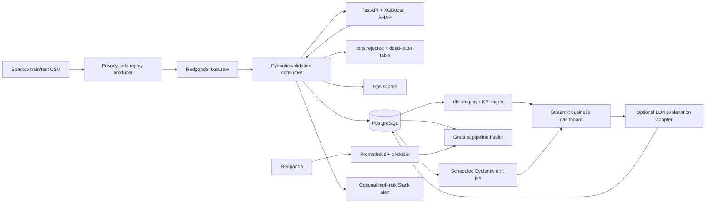

# LossGuard

LossGuard is a local reference implementation of a transaction-risk platform. It recommends
`approve`, `verify`, or `decline` by comparing expected fraud loss with the cost of inconveniencing
legitimate customers. The project covers streaming ingestion, validation, model serving,
cost-sensitive policy selection, analytics, observability, drift monitoring, and explainability.

LossGuard is a retrospective simulation. It does not authorize payments or claim realized merchant
savings.

## Project status

| Phase | Capability | Status |
|---:|---|---|
| 0 | Scope, decision framing, and business assumptions | Complete |
| 1 | Redpanda/PostgreSQL streaming pipeline and dead-letter handling | Complete |
| 2 | XGBoost scoring, cost-sensitive thresholds, FastAPI, and SHAP | Complete |
| 3 | dbt marts and Streamlit business dashboard | Complete |
| 4 | Prometheus/Grafana observability and optional Slack alerts | Complete |
| 5 | Scheduled Evidently drift monitoring | Complete |
| 6 | Cached plain-English decision explanations | Complete |
| 7 | Current-dated simulator and Stripe Sandbox webhooks | Proposed |

## Decision problem

A permissive fraud policy loses money to fraud; an aggressive policy loses legitimate customers.
LossGuard asks a narrower operational question: for each merchant category, which verification and
decline thresholds minimize the modeled total cost? See the [scope](docs/phase-0-scope.md) and
[business assumptions](docs/business-assumptions.md) for the exact decision framing.

## Dataset

The project uses the public synthetic [Sparkov/Kaggle fraud dataset](https://www.kaggle.com/datasets/kartik2112/fraud-detection).
The files are deliberately excluded from Git and must be placed in `dataset/` locally.

| File | Use | Rows | Event-time range |
|---|---|---:|---|
| `fraudTrain.csv` | Training and drift reference | 1,296,675 | 2019-01-01 00:00:18 to 2020-06-21 12:13:37 |
| `fraudTest.csv` | Replay and final evaluation source | 555,719 | 2020-06-21 12:14:25 to 2020-12-31 23:59:34 |

The combined source contains 1,852,394 simulated transactions and 9,651 fraud labels. Customer
margin, lifetime value, verification cost, abandonment, and reacquisition cost are additional
documented assumptions rather than merchant facts.

### Interview pitch

> I built a streaming fraud-decision system that optimizes a documented cost function instead of
> accuracy alone. It validates and scores privacy-safe events, learns category-specific action
> thresholds, and presents the resulting fraud-versus-friction trade-off with transaction-level
> explanations and operational monitoring.

## Architecture



## Technology stack

| Layer | Choice | Purpose |
|---|---|---|
| Runtime | Python 3.12 | Stable supported data/ML container runtime |
| Streaming | Redpanda | Kafka-compatible raw, scored, and rejected topics |
| Validation | Pydantic v2 | Strict event schema and business-rule validation |
| Storage | PostgreSQL 16 | Decisions, explanations, dead letters, and metrics |
| Modeling | XGBoost + scikit-learn | Imbalanced classification and preprocessing |
| Explainability | SHAP | Per-transaction feature contributions |
| Explanation layer | Anthropic, OpenAI, Gemini, compatible endpoints, or local fallback | One-sentence business explanation |
| API | FastAPI | Health, scoring, and model-reload endpoints |
| Transformation | dbt-postgres | Tested staging and KPI marts |
| Dashboard | Streamlit + Plotly | Business KPIs, threshold simulation, explanations |
| Observability | Prometheus + Grafana + cAdvisor | Lag, throughput, failures, container health |
| Drift monitoring | Evidently | Scheduled training-vs-current feature comparison |
| Packaging | Docker Compose | Reproducible local services |

## Privacy and prompt-injection boundary

- The producer reads names, addresses, dates of birth, and card numbers only to derive safe fields.
- Card numbers become salted SHA-256 customer IDs; name, address, raw card, and date of birth are dropped.
- Dataset text is treated strictly as data. No field is executed as code or used as an instruction.
- External explanation providers receive only allowlisted, typed transaction fields and SHAP
  drivers—not merchant or customer free text. Output must be one sentence under 30 words or the
  local template is used instead.
- Logs use transaction IDs and never intentionally print raw source rows.
- Change `PII_HASH_SALT` before any shared deployment.

## Quick start

Prerequisites: Docker Desktop with its Linux engine running, Docker Compose, at least 6 GB free
memory, and both dataset CSV files in `dataset/`. Commands below are run from the repository root.
Local services mount `src/`, `apps/`, and the dbt project so source changes are picked up without
rebuilding the large ML image; `--build` still creates reproducible standalone images.

```powershell
Copy-Item .env.example .env
docker compose up -d --build
```

The API starts before training, but `/health` clearly reports `development_heuristic`. Train a real
Phase 2 artifact, reload the API, and replay a bounded test stream:

```powershell
docker compose --profile tools run --rm trainer
Invoke-RestMethod -Method Post http://localhost:8000/reload
docker compose run --rm producer
docker compose --profile tools run --rm dbt build --profiles-dir .
```

Open:

- Streamlit: <http://localhost:8501>
- FastAPI docs: <http://localhost:8000/docs>
- Redpanda Kafka listener: `localhost:19092`
- PostgreSQL: `localhost:55432` (containers use `postgres:5432` internally)
- Grafana pipeline health: <http://localhost:3000> (local default `admin` / `lossguard_admin_local`)
- Prometheus: <http://localhost:9090>

The default replay is limited to 10,000 test rows in `demo` mode. Demo mode compresses source time by
720x, so roughly one source day plays in two minutes. Use `max` for throughput testing:

```powershell
docker compose run --rm -e REPLAY_LIMIT=50000 -e REPLAY_MODE=max producer
```

Replay timing can be selected with `REPLAY_MODE` or the producer's `--mode` flag:

| Mode | Timing |
|---|---|
| `demo` (default) | `max(actual_gap / 720, 0.001)` seconds |
| `realtime` | Real source gap with a two-second cap and 0.001-second floor |
| `max` | No artificial delay; broker and consumer throughput set the pace |

The realtime two-second cap is a deliberate demo simplification: overnight or otherwise long source
gaps do not stall a live walkthrough. For example, the CLI flag can override the environment:

```powershell
docker compose run --rm producer --mode realtime
```

## Phase-by-phase implementation

### Phase 0 — scope

`docs/phase-0-scope.md` defines the problem, users, decisions, success criteria, non-goals, and
interview pitch. `docs/business-assumptions.md` defines every simulated dollar input.

### Phase 1 — local streaming MVP

1. The producer reads the large CSV incrementally with `csv.DictReader`.
2. It hashes the customer identifier and derives category, channel, margin, LTV band, age, and location.
3. Replay timing follows the timestamp-sorted source in real time, 720x demo, or maximum-throughput mode.
4. Pydantic validates the privacy-safe event before publication to `txns.raw`.
5. The consumer validates again, calls the scorer, persists the decision, and publishes `txns.scored`.
6. Invalid JSON/schema/API failures go to PostgreSQL and `txns.rejected`; the Kafka offset commits only
   after persistence, so processing is at-least-once and the scored table is idempotent by transaction ID.

### Phase 2 — cost-sensitive scoring

1. `ml/train.py` takes the first 80% of timestamp-sorted data for training and the last 20% for validation.
2. It engineers amount, distance, time, age, population, category, channel, margin, and LTV features.
3. XGBoost uses class weighting for the severe fraud imbalance.
4. A validation grid searches verification/decline thresholds for every category using the documented
   realized-cost function; sparse segments fall back to global thresholds.
5. The bundle contains preprocessing, model, thresholds, version, and interpretable feature names.
6. FastAPI returns risk, action, thresholds, three expected costs, retrospective policy cost, savings,
   and the largest SHAP contributions.

The default training cap is 300,000 rows for laptop practicality. Set `TRAIN_MAX_ROWS=0` to use all rows.
The supplied test set remains a final untouched evaluation/replay source.

### Phase 3 — business dashboard

1. dbt creates a typed staging view and daily/segment marts.
2. dbt tests source uniqueness, accepted decisions, and mart grain.
3. Streamlit reads the marts for headline value, risk/quality guardrails, trends, segment comparison,
   and a dollar outcome breakdown for fraud caught, friction, fraud missed, and normal approvals.
4. A threshold slider recomputes policy cost, decision counts, and all four dollar outcomes on bounded
   labeled rows without a browser page reload.
5. A transaction drill-down renders stored SHAP contributions and model version.
6. Source freshness, definitions, and simulation caveats are visible in the app.

### Phase 4 — observability and high-risk alerts

1. Prometheus scrapes Redpanda `/public_metrics` every five seconds and stores seven days locally.
2. Redpanda exports dedicated consumer-group lag gauges for `lossguard-scorers`.
3. cAdvisor supplies container freshness/resource telemetry.
4. Grafana is provisioned from version-controlled files with PostgreSQL and Prometheus data sources.
5. The pipeline dashboard covers ingestion volume, consumer lag, validation failure rate, and
   container health. PostgreSQL access uses a read-only `grafana_reader` role.
6. The consumer optionally sends a privacy-safe Slack webhook alert when risk meets
   `SLACK_HIGH_RISK_THRESHOLD`. No alert is sent unless `SLACK_WEBHOOK_URL` is configured.

To enable Slack locally, set this only in the uncommitted `.env` file, then recreate the consumer:

```powershell
SLACK_WEBHOOK_URL=https://hooks.slack.com/services/...
SLACK_HIGH_RISK_THRESHOLD=0.90
docker compose up -d consumer
```

Verify the required 60-second lag spike. This intentionally kills and restarts only the consumer;
its Kafka offsets and PostgreSQL data are preserved:

```powershell
powershell -ExecutionPolicy Bypass -File scripts/verify_observability.ps1
```

### Phase 5 — scheduled drift monitoring

1. `drift-monitor` runs immediately at startup and then every seven days by default.
2. Evidently 0.7.21 compares the latest processed feature snapshots with a deterministic sample of
   `fraudTrain.csv` using `DataDriftPreset`.
3. JSON and HTML reports are written under `reports/drift/`; summary rows are persisted in
   `model_drift_reports`.
4. Streamlit displays `Model health: OK`, `DRIFTING`, `INSUFFICIENT DATA`, or `ERROR` from the latest
   persisted result. The default alert boundary is 30% of monitored features drifting.
5. Current rows are selected by `processed_at`, so replaying a different source slice naturally
   changes the rolling comparison even when transaction event dates are historical.

Run a normal report or the documented in-memory shift acceptance demonstration:

```powershell
docker compose run --rm drift-monitor python -m monitoring.drift_job
docker compose run --rm drift-monitor python -m monitoring.drift_job --simulate-shift
```

The second command deliberately changes the analysis frame only; it does not modify transaction
records. Refresh Streamlit after it finishes and the latest model-health indicator will show the
persisted result.

### Phase 6 — plain-English explanation layer

1. Opening a transaction in Streamlit lazily converts its strongest SHAP drivers into one business
   sentence; the full SHAP bar chart remains directly underneath.
2. The provider-neutral adapter supports Anthropic Claude, OpenAI API models, Google Gemini, and
   OpenAI-compatible Chat Completions endpoints (for example Ollama, Groq, Mistral, or OpenRouter).
   Without a valid provider configuration it immediately uses a deterministic local sentence.
3. Provider and fallback results are cached on `scored_transactions`, so dashboard reruns do not
   repeat API calls. Re-scoring with a new fraud-model version invalidates the cached wording. A
   cached fallback is upgraded once when a provider is later enabled.
4. API timeouts, invalid responses, technical jargon, multiple sentences, and responses over 30 words
   automatically fall back without breaking the review panel.
5. The prompt boundary excludes raw merchant/customer text and sends only numeric values, supported
   categories, enums, and allowlisted feature labels.

All external providers are optional. Put secrets only in the ignored `.env` file and select exactly
one provider. `LLM_PROVIDER=auto` checks Anthropic, OpenAI, Gemini, then an OpenAI-compatible endpoint;
use an explicit value when more than one credential is present.

Anthropic Claude:

```dotenv
LLM_PROVIDER=anthropic
ANTHROPIC_API_KEY=your-key-here
ANTHROPIC_MODEL=claude-haiku-4-5-20251001
```

OpenAI Responses API:

```dotenv
LLM_PROVIDER=openai
OPENAI_API_KEY=your-key-here
OPENAI_MODEL=gpt-5.4-mini
```

Google Gemini:

```dotenv
LLM_PROVIDER=gemini
GEMINI_API_KEY=your-key-here
GEMINI_MODEL=gemini-3.5-flash-lite
```

OpenAI-compatible endpoint; the API key may be blank for a local server such as Ollama:

```dotenv
LLM_PROVIDER=openai_compatible
OPENAI_COMPATIBLE_BASE_URL=http://host.docker.internal:11434/v1
OPENAI_COMPATIBLE_MODEL=llama3.2
OPENAI_COMPATIBLE_API_KEY=
```

The dashboard never accepts a provider URL, model, or secret from browser input. It sends only
allowlisted typed transaction facts, validates every provider response as one non-technical sentence
under 30 words, and falls back locally on timeout, authentication failure, malformed output, or an
invalid compatible endpoint URL.

Then recreate the dashboard so it receives the new environment:

```powershell
docker compose up -d --force-recreate dashboard
```

## Tests and quality checks

```powershell
docker compose --profile tools run --rm test
docker compose --profile tools run --rm lint
docker compose config --quiet
```

GitHub Actions runs linting, formatting checks, unit tests, notebook validation, and Compose
configuration validation on every push and pull request.

Verify the Phase 1 dead-letter acceptance with one uniquely identified malformed event:

```powershell
docker compose run --rm producer python scripts/verify_dead_letter.py
```

For a non-Docker developer environment, use Python 3.12 and install `.[dev,dbt,notebook,monitoring]` in a
virtual environment. The extras are split so notebook tooling is not required by deployed services.

Tests cover privacy transformations, schemas, feature engineering, action boundaries, cost calculations,
threshold optimization, dashboard reconciliation, scorer fallback behavior, prompt allowlisting,
provider selection, all four provider response formats, and failure/output validation.

## Repository map

```text
streamlit_app.py      canonical Streamlit dashboard entrypoint
apps/                 producer, consumer, scoring API, Streamlit dashboard
analytics/dbt/        sources, staging model, KPI marts, and tests
docs/                 Phase 0 and documented assumptions
infrastructure/       PostgreSQL, Prometheus, and Grafana provisioning
monitoring/           Evidently drift job, scheduler, and dedicated container
ml/                   training data preparation and training entrypoint
models/               generated model binary (ignored) and tracked model metadata
notebooks/            reproducible model walkthrough
src/lossguard/        shared schemas, features, costs, privacy, Kafka, database
tests/                unit tests
dataset/              supplied train/test CSV files (unchanged and ignored)
```

## Roadmap

The proposed next phase adds two complementary sources without changing the reproducible Sparkov
baseline:

- A [Fraud Detection Handbook simulator](https://fraud-detection-handbook.github.io/fraud-detection-handbook/Chapter_3_GettingStarted/SimulatedDataset.html)
  adapter for high-volume, current-dated simulations with controlled fraud spikes and distribution
  shifts.
- A [Stripe Sandbox](https://docs.stripe.com/testing) webhook adapter for payment-provider
  integration and delayed dispute/outcome reconciliation. Stripe Sandbox is for integration
  testing, not load testing.

Both sources would normalize into the existing privacy-safe event schema before Redpanda. They are
not part of the current implementation and are not represented as live production data.

## Limitations and operating boundaries

- This is a decision-support simulation, not a payment authorization service.
- Fraud labels are immediately available only because this is a replay dataset; production labels arrive later.
- `/reload` is intentionally unauthenticated for local development and must be protected before deployment.
- The default local credentials, unauthenticated reload endpoint, and single-node infrastructure are
  development conveniences, not production controls.
- Public deployment, payment-provider ingestion, delayed-label reconciliation, and independent
  model evaluation remain future work.

## License

LossGuard is available under the [MIT License](LICENSE).
